# 🗺️ MAPA D'APP + BACKLOG - Freedoliapp

**Data**: 2024  
**Basat en**: Anàlisi del codi real (no suposicions)  
**Objectiu**: Entendre què tenim, què falta i què millorar ràpid

---

## 1️⃣ DIAGRAMA DE NAVEGACIÓ I DEPENDÈNCIES

```mermaid
graph TB
    App[App.jsx<br/>BrowserRouter + AppProvider]
    
    App --> Login[Login.jsx<br/>Auth]
    App --> AppContent[AppContent<br/>Sidebar + Routes]
    
    AppContent --> Dashboard[Dashboard<br/>1435 lines]
    AppContent --> Projects[Projects<br/>473 lines]
    AppContent --> ProjectDetail[ProjectDetail<br/>806 lines]
    AppContent --> Orders[Orders<br/>1616 lines]
    AppContent --> Finances[Finances<br/>1787 lines]
    AppContent --> Inventory[Inventory<br/>693 lines]
    AppContent --> Suppliers[Suppliers<br/>714 lines]
    AppContent --> Forwarders[Forwarders<br/>710 lines]
    AppContent --> Warehouses[Warehouses<br/>530 lines]
    AppContent --> Analytics[Analytics<br/>589 lines]
    AppContent --> Calendar[Calendar<br/>545 lines]
    AppContent --> Settings[Settings<br/>876 lines]
    AppContent --> Help[Help<br/>262 lines]
    AppContent --> Briefing[Briefing<br/>685 lines]
    AppContent --> Diagnostics[Diagnostics<br/>749 lines]
    AppContent --> DevSeed[DevSeed<br/>1153 lines]
    
    Dashboard --> LogisticsTrackingWidget[LogisticsTrackingWidget]
    Dashboard --> DailyOpsWidgets[DailyOpsWidgets<br/>816 lines]
    Dashboard --> TasksWidget[TasksWidget<br/>533 lines]
    Dashboard --> StickyNotesWidget[StickyNotesWidget<br/>831 lines]
    Dashboard --> NewProjectModal[NewProjectModal<br/>460 lines]
    
    Projects --> NewProjectModal
    
    ProjectDetail --> IdentifiersSection[IdentifiersSection<br/>596 lines]
    ProjectDetail --> ProfitabilityCalculator[ProfitabilityCalculator<br/>823 lines]
    ProjectDetail --> QuotesSection[QuotesSection<br/>1141 lines]
    ProjectDetail --> TasksSection[TasksSection<br/>497 lines]
    ProjectDetail --> DecisionLog[DecisionLog<br/>430 lines]
    ProjectDetail --> FileBrowser[FileBrowser]
    ProjectDetail --> FileUploader[FileUploader]
    
    Orders --> NewPOModal[NewPOModal<br/>1154 lines]
    Orders --> LogisticsFlow[LogisticsFlow<br/>556 lines]
    Orders --> ShipmentTrackingSection[ShipmentTrackingSection<br/>488 lines]
    Orders --> AmazonReadySection[AmazonReadySection<br/>288 lines]
    Orders --> ManufacturerPackModal[ManufacturerPackModal<br/>596 lines]
    Orders --> TasksSection
    Orders --> DecisionLog
    Orders --> PlannedVsActual[PlannedVsActual<br/>240 lines]
    
    Finances --> ReceiptUploader[ReceiptUploader<br/>396 lines]
    Finances --> RecurringExpensesSection[RecurringExpensesSection<br/>567 lines]
    
    Inventory --> supabase[supabase.from inventory]
    
    Analytics --> Charts[Charts<br/>expenses/incomes]
    
    Settings --> DriveStatus[DriveStatus<br/>303 lines]
    
    subgraph "Serveis (src/lib)"
        supabase[supabase.js<br/>3174 lines<br/>139 queries]
        googleDrive[googleDrive.js]
        profitability[profitability.js]
        amazonReady[amazonReady.js]
        generatePOPdf[generatePOPdf.js]
        generateFnskuLabelsPdf[generateFnskuLabelsPdf.js]
        generateManufacturerPack[generateManufacturerPack.js]
        auditLog[auditLog.js]
        errorHandling[errorHandling.js]
    end
    
    subgraph "Taules Supabase"
        projects[projects]
        purchase_orders[purchase_orders]
        suppliers[suppliers]
        expenses[expenses]
        incomes[incomes]
        tasks[tasks]
        sticky_notes[sticky_notes]
        decision_log[decision_log]
        product_identifiers[product_identifiers]
        gtin_pool[gtin_pool]
        po_amazon_readiness[po_amazon_readiness]
        po_shipments[po_shipments]
        supplier_quotes[supplier_quotes]
        dashboard_preferences[dashboard_preferences]
        finance_categories[finance_categories]
        recurring_expenses[recurring_expenses]
        inventory[inventory]
        inventory_movements[inventory_movements]
        documents[documents]
        company_settings[company_settings]
        warehouses[warehouses]
        audit_log[audit_log]
        project_profitability_basic[project_profitability_basic]
        logistics_flow[logistics_flow]
    end
    
    Dashboard -.->|queries| projects
    Dashboard -.->|queries| purchase_orders
    Dashboard -.->|queries| expenses
    Dashboard -.->|queries| incomes
    Dashboard -.->|queries| tasks
    Dashboard -.->|queries| sticky_notes
    Dashboard -.->|queries| dashboard_preferences
    
    Projects -.->|queries| projects
    
    ProjectDetail -.->|queries| projects
    ProjectDetail -.->|queries| product_identifiers
    ProjectDetail -.->|queries| supplier_quotes
    ProjectDetail -.->|queries| tasks
    ProjectDetail -.->|queries| decision_log
    ProjectDetail -.->|queries| documents
    ProjectDetail -.->|queries| project_profitability_basic
    
    Orders -.->|queries| purchase_orders
    Orders -.->|queries| projects
    Orders -.->|queries| suppliers
    Orders -.->|queries| po_amazon_readiness
    Orders -.->|queries| po_shipments
    Orders -.->|queries| product_identifiers
    Orders -.->|queries| tasks
    Orders -.->|queries| decision_log
    Orders -.->|queries| supplier_quotes
    
    Finances -.->|queries| expenses
    Finances -.->|queries| incomes
    Finances -.->|queries| finance_categories
    Finances -.->|queries| recurring_expenses
    
    Inventory -.->|queries| inventory
    Inventory -.->|queries| inventory_movements
    Inventory -.->|queries| projects
    
    Analytics -.->|queries| expenses
    Analytics -.->|queries| incomes
    Analytics -.->|queries| purchase_orders
    Analytics -.->|queries| projects
    Analytics -.->|queries| product_identifiers
    Analytics -.->|queries| gtin_pool
    
    style Dashboard fill:#ff6b6b
    style Orders fill:#ff6b6b
    style Finances fill:#ff6b6b
    style ProjectDetail fill:#ffd93d
    style NewPOModal fill:#ffd93d
    style QuotesSection fill:#ffd93d
```

---

## 2️⃣ ANÀLISI PER MÒDUL

### 📊 Dashboard (1435 línies)

**Què fa**: Vista general amb widgets personalitzables, stats, alerts i accions ràpides

**Taules Supabase**:
- `projects` (SELECT)
- `purchase_orders` (SELECT)
- `expenses` (SELECT)
- `incomes` (SELECT)
- `tasks` (SELECT)
- `sticky_notes` (SELECT)
- `dashboard_preferences` (SELECT, UPDATE)
- `po_amazon_readiness` (SELECT)
- `product_identifiers` (SELECT)
- `gtin_pool` (SELECT)

**Components usats**:
- `LogisticsTrackingWidget` (483 línies)
- `DailyOpsWidgets` (816 línies) - 5 widgets
- `TasksWidget` (533 línies)
- `StickyNotesWidget` (831 línies)
- `NewProjectModal` (460 línies)
- `CustomizeDashboardModal` (534 línies)
- `AddStickyNoteModal` (266 línies)
- `SafeWidget` (90 línies) - wrapper error handling

**Errors típics**:
- ❌ Null checks: `orders?.length`, `projects?.filter`, `stats?.total`
- ❌ Missing fields: `order.project?.name`, `order.supplier?.name`
- ❌ RLS: Totes les queries usen `getCurrentUserId()` correctament
- ❌ Imports: Tots correctes
- ❌ Array operations: `.map()`, `.filter()` amb null checks (`safeArray()`)

**Pain points**:
- 🔴 **Fitxer massa gran** (1435 línies) - difícil de mantenir
- 🔴 **Molts widgets** (9 widgets diferents) - complexitat alta
- 🟡 **GridLayout dependency** - pot causar errors de renderitzat
- 🟡 **DailyOpsWidgets** (816 línies) - podria ser 5 fitxers separats

---

### 📦 Projects (473 línies)

**Què fa**: Llista de projectes amb filtres per fase i cerca

**Taules Supabase**:
- `projects` (SELECT, DELETE via `deleteProject()`)

**Components usats**:
- `Header` (114 línies)
- `NewProjectModal` (460 línies)

**Errors típics**:
- ❌ Null checks: `project.name?.toLowerCase()`, `project.decision !== 'DISCARDED'`
- ❌ Missing fields: `project.project_code` pot ser null
- ❌ RLS: Correcte (via `getProjects()`)
- ❌ Array operations: `.filter()` amb null checks

**Pain points**:
- 🟢 **Fitxer raonable** (473 línies) - OK
- 🟢 **Simple i funcional** - poc manteniment necessari

---

### 📦 ProjectDetail (806 línies)

**Què fa**: Vista completa d'un projecte amb totes les seccions (Identifiers, Profitability, Quotes, Tasks, Decision Log, Documents)

**Taules Supabase**:
- `projects` (SELECT, UPDATE)
- `product_identifiers` (SELECT, UPSERT via `IdentifiersSection`)
- `project_profitability_basic` (SELECT, UPSERT via `ProfitabilityCalculator`)
- `supplier_quotes` (SELECT, INSERT, UPDATE via `QuotesSection`)
- `tasks` (SELECT, INSERT, UPDATE, DELETE via `TasksSection`)
- `decision_log` (SELECT, INSERT, UPDATE via `DecisionLog`)
- `documents` (SELECT, INSERT via `FileUploader`)

**Components usats**:
- `Header` (114 línies)
- `IdentifiersSection` (596 línies)
- `ProfitabilityCalculator` (823 línies)
- `QuotesSection` (1141 línies)
- `TasksSection` (497 línies)
- `DecisionLog` (430 línies)
- `QuickSupplierPriceEstimate` (505 línies)
- `FileBrowser` (246 línies)
- `FileUploader` (214 línies)

**Errors típics**:
- ❌ Null checks: `project?.name`, `project?.phase`, `documents?.length`
- ❌ Missing fields: `project.project_code`, `project.sku`, `project.sku_internal`
- ❌ RLS: Correcte (totes les funcions usen `getCurrentUserId()`)
- ❌ Google Drive: Errors de connexió, tokens expirats
- ❌ Array operations: `documents?.map()` amb null checks

**Pain points**:
- 🟡 **Fitxer gran** (806 línies) - podria dividir-se en sub-seccions
- 🔴 **QuotesSection massa gran** (1141 línies) - crític
- 🔴 **ProfitabilityCalculator gran** (823 línies) - podria simplificar-se
- 🟡 **Moltes seccions** - podria usar tabs o acordions

---

### 🛒 Orders (1616 línies) ⚠️ CRÍTIC

**Què fa**: Gestió completa de Purchase Orders amb tracking, Amazon Ready, Manufacturer Pack, labels, shipments

**Taules Supabase**:
- `purchase_orders` (SELECT, INSERT, UPDATE, DELETE)
- `projects` (SELECT)
- `suppliers` (SELECT)
- `po_amazon_readiness` (SELECT, UPSERT)
- `po_shipments` (SELECT, UPSERT)
- `product_identifiers` (SELECT)
- `supplier_quotes` (SELECT)
- `tasks` (SELECT, INSERT, UPDATE, DELETE via `TasksSection`)
- `decision_log` (SELECT, INSERT, UPDATE via `DecisionLog`)
- `company_settings` (SELECT)

**Components usats**:
- `Header` (114 línies)
- `NewPOModal` (1154 línies) ⚠️ MASSIU
- `LogisticsFlow` (556 línies)
- `ShipmentTrackingSection` (488 línies)
- `AmazonReadySection` (288 línies)
- `ManufacturerPackModal` (596 línies)
- `TasksSection` (497 línies)
- `DecisionLog` (430 línies)
- `PlannedVsActual` (240 línies)

**Errors típics**:
- ❌ Null checks: `order?.po_number`, `order?.project?.name`, `order?.supplier?.name`
- ❌ Missing fields: `order.project_id`, `order.status`, `selectedOrder.items` (pot ser string JSON)
- ❌ RLS: Correcte (totes les funcions usen `getCurrentUserId()`)
- ❌ Array operations: `filteredOrders.map()`, `orders?.filter()` amb null checks
- ❌ JSON parsing: `JSON.parse(selectedOrder.items)` pot fallar
- ❌ PDF generation: Errors de jsPDF, missing data

**Pain points**:
- 🔴 **Fitxer massa gran** (1616 línies) - **CRÍTIC**
- 🔴 **NewPOModal massa gran** (1154 línies) - **CRÍTIC**
- 🟡 **Formulari PO molt llarg** - molts camps
- 🟡 **Modal de detall enorme** - moltes seccions
- 🟡 **Manufacturer Pack complex** - moltes opcions

---

### 💰 Finances (1787 línies) ⚠️ CRÍTIC

**Què fa**: Gestió completa de despeses, ingressos, categories, recurring expenses, charts, saved views

**Taules Supabase**:
- `expenses` (SELECT, INSERT, UPDATE, DELETE)
- `incomes` (SELECT, INSERT, UPDATE, DELETE)
- `finance_categories` (SELECT, INSERT, UPDATE, DELETE)
- `recurring_expenses` (SELECT, INSERT, UPDATE, DELETE)
- `receipts` (SELECT, INSERT via `ReceiptUploader`)
- `projects` (SELECT)
- `suppliers` (SELECT)

**Components usats**:
- `Header` (114 línies)
- `ReceiptUploader` (396 línies)
- `RecurringExpensesSection` (567 línies)

**Errors típics**:
- ❌ Null checks: `ledger?.map()`, `category?.name`, `transaction?.amount`
- ❌ Missing fields: `expense.project_id`, `income.project_id`
- ❌ RLS: Correcte (totes les queries usen `getCurrentUserId()`)
- ❌ Array operations: `.filter()`, `.map()`, `.reduce()` amb null checks
- ❌ Charts: Errors si no hi ha dades

**Pain points**:
- 🔴 **Fitxer massa gran** (1787 línies) - **CRÍTIC**
- 🟡 **Moltes vistes i filtres** - complexitat alta
- 🟡 **Charts complexos** - potser massa opcions
- 🟡 **Saved Views** - funcionalitat avançada però potser poc usada

---

### 📦 Inventory (693 línies)

**Què fa**: Tracking d'estoc per ubicació (producció, trànsit, Amazon FBA, venut)

**Taules Supabase**:
- `inventory` (SELECT, INSERT, UPDATE)
- `inventory_movements` (SELECT, INSERT)
- `projects` (SELECT)

**Components usats**:
- `Header` (114 línies)

**Errors típics**:
- ❌ Null checks: `inventory?.map()`, `movements?.filter()`
- ❌ Missing fields: `item.project_id`, `item.sku`
- ❌ RLS: Correcte (queries usen `getCurrentUserId()`)
- ❌ Array operations: `.map()`, `.filter()` amb null checks

**Pain points**:
- 🟢 **Fitxer raonable** (693 línies) - OK
- ⚠️ **Potser poc usat** - validar si es fa servir realment

---

### 🏭 Suppliers (714 línies)

**Què fa**: Base de dades de proveïdors amb contactes i informació

**Taules Supabase**:
- `suppliers` (SELECT, INSERT, UPDATE, DELETE)
- `purchase_orders` (SELECT - per historial)

**Components usats**:
- `Header` (114 línies)

**Errors típics**:
- ❌ Null checks: `supplier?.name`, `supplier?.email`
- ❌ Missing fields: `supplier.contact_name`, `supplier.phone`
- ❌ RLS: Correcte

**Pain points**:
- 🟢 **Fitxer raonable** (714 línies) - OK
- 🟡 **Funcionalitat bàsica** - podria tenir més features (historial, ratings)

---

### 🚚 Forwarders (710 línies)

**Què fa**: Gestió de transitàries

**Taules Supabase**:
- `forwarders` (SELECT, INSERT, UPDATE, DELETE) - si existeix la taula

**Components usats**:
- `Header` (114 línies)

**Errors típics**:
- ❌ Null checks: `forwarder?.name`
- ❌ Missing fields: Potser la taula no existeix

**Pain points**:
- ⚠️ **Potser buit/no usat** - validar si es fa servir
- 🟡 **Funcionalitat mínima**

---

### 🏢 Warehouses (530 línies)

**Què fa**: Gestió de magatzems

**Taules Supabase**:
- `warehouses` (SELECT, INSERT, UPDATE, DELETE)

**Components usats**:
- `Header` (114 línies)

**Errors típics**:
- ❌ Null checks: `warehouse?.name`
- ❌ Missing fields: `warehouse.address`

**Pain points**:
- ⚠️ **Potser buit/no usat** - validar si es fa servir
- 🟡 **Funcionalitat mínima**

---

### 📈 Analytics (589 línies)

**Què fa**: KPIs, gràfiques de despeses/ingressos, cobertura GTIN

**Taules Supabase**:
- `expenses` (SELECT)
- `incomes` (SELECT)
- `purchase_orders` (SELECT)
- `projects` (SELECT)
- `product_identifiers` (SELECT)
- `gtin_pool` (SELECT)

**Components usats**:
- `Header` (114 línies)

**Errors típics**:
- ❌ Null checks: `expenses?.filter()`, `incomes?.map()`
- ❌ Missing fields: `expense.project_id`, `income.project_id`
- ❌ RLS: Correcte
- ❌ Charts: Errors si no hi ha dades

**Pain points**:
- 🟢 **Fitxer raonable** (589 línies) - OK
- 🟡 **Charts poden millorar** - visualització

---

### 📅 Calendar (545 línies)

**Què fa**: Vista de calendari per tasks i dates

**Taules Supabase**:
- `tasks` (SELECT)
- `purchase_orders` (SELECT)
- `projects` (SELECT)

**Components usats**:
- `Header` (114 línies)

**Errors típics**:
- ❌ Null checks: `tasks?.map()`, `events?.filter()`
- ❌ Missing fields: `task.due_date`, `task.title`
- ❌ RLS: Correcte

**Pain points**:
- 🟢 **Fitxer raonable** (545 línies) - OK
- 🟡 **Potser poc usat** - validar

---

### ⚙️ Settings (876 línies)

**Què fa**: Configuració de l'app, company settings, integracions (Google Drive), idioma

**Taules Supabase**:
- `company_settings` (SELECT, UPDATE)
- `dashboard_preferences` (SELECT, UPDATE)

**Components usats**:
- `Header` (114 línies)
- `DriveStatus` (303 línies)

**Errors típics**:
- ❌ Null checks: `settings?.company_name`
- ❌ Missing fields: `settings.demo_mode`
- ❌ RLS: Correcte
- ❌ Google Drive: Errors de connexió, tokens

**Pain points**:
- 🟡 **Fitxer gran** (876 línies) - podria dividir-se
- 🟡 **Google Drive setup complex** - podria millorar wizard

---

## 3️⃣ DUPLICACIONS REALS DETECTADES

### 🔄 Logistics (3 components similars)

**Components**:
1. `LogisticsFlow.jsx` (556 línies) - Usat a Orders
2. `LogisticsTrackingWidget.jsx` (483 línies) - Usat a Dashboard
3. `ShipmentTrackingSection.jsx` (488 línies) - Usat a Orders

**Problema**: 
- 3 components que fan tracking logístic però amb implementacions diferents
- `LogisticsFlow` usa taula `logistics_flow`
- `LogisticsTrackingWidget` i `ShipmentTrackingSection` usen `po_shipments`
- Lògica duplicada per calcular estats

**Solució proposada**:
- Unificar en un sol component `LogisticsTracker` amb props per context (widget vs detail)
- O crear hook `useLogisticsTracking` compartit

**Fitxers a tocar**:
- `src/components/LogisticsFlow.jsx`
- `src/components/LogisticsTrackingWidget.jsx`
- `src/components/ShipmentTrackingSection.jsx`
- `src/pages/Orders.jsx`
- `src/pages/Dashboard.jsx`

---

### 🔄 Tasks (3 components similars)

**Components**:
1. `TasksSection.jsx` (497 línies) - Usat a ProjectDetail i Orders
2. `TasksWidget.jsx` (533 línies) - Usat a Dashboard
3. `QuickCreateTaskModal.jsx` (239 línies) - Usat a Dashboard

**Problema**:
- `TasksSection` i `TasksWidget` tenen lògica similar però diferent UI
- `QuickCreateTaskModal` duplica funcionalitat de `TasksSection`

**Solució proposada**:
- Unificar `TasksSection` i `TasksWidget` en un sol component amb props `mode="section"|"widget"`
- `QuickCreateTaskModal` pot usar el mateix component internament

**Fitxers a tocar**:
- `src/components/TasksSection.jsx`
- `src/components/TasksWidget.jsx`
- `src/components/QuickCreateTaskModal.jsx`
- `src/pages/Dashboard.jsx`
- `src/pages/ProjectDetail.jsx`
- `src/pages/Orders.jsx`

---

### 🔄 Decision Log (1 component, múltiples usos)

**Component**:
- `DecisionLog.jsx` (430 línies) - Usat a ProjectDetail i Orders

**Problema**:
- ✅ **NO és duplicació** - és un sol component reutilitzat correctament
- Però potser massa gran per un component "simple"

**Solució proposada**:
- Mantenir com està (és correcte)
- Potser simplificar si no es fa servir tot

---

### 🔄 Charts (duplicació de lògica)

**On**:
- `Dashboard.jsx` - Finance Chart
- `Finances.jsx` - Múltiples charts
- `Analytics.jsx` - Charts

**Problema**:
- Lògica de processament de dades duplicada
- Càlculs similars (totals, mitjanes, agrupacions)

**Solució proposada**:
- Crear hooks `useFinanceChart`, `useExpenseChart`, etc.
- O utilitat `chartUtils.js` amb funcions compartides

**Fitxers a tocar**:
- `src/pages/Dashboard.jsx`
- `src/pages/Finances.jsx`
- `src/pages/Analytics.jsx`
- `src/lib/chartUtils.js` (nou)

---

## 4️⃣ BACKLOG PRIORITZAT

### 🚨 A) BLOQUEJA TREBALL REAL (S'ha de fer ja)

#### A1. Refactoritzar Orders.jsx (1616 línies)
**Problema**: Fitxer massa gran, difícil de mantenir, errors freqüents  
**Impacte**: ⭐⭐⭐⭐⭐ (Crític - Orders és core del negoci)  
**Esforç**: 4-6h

**Accions**:
1. Dividir en sub-components:
   - `OrdersList.jsx` (llista + filtres)
   - `OrderDetailModal.jsx` (modal de detall)
   - `OrderStats.jsx` (estadístiques)
   - `OrderFilters.jsx` (filtres)
2. Moure lògica a hooks:
   - `useOrders.js` (loadData, handleDelete, etc.)
   - `useOrderDetail.js` (handleViewOrder, loadAmazonReadiness, etc.)

**Fitxers a tocar**:
- `src/pages/Orders.jsx` → dividir
- `src/components/OrdersList.jsx` (nou)
- `src/components/OrderDetailModal.jsx` (nou)
- `src/components/OrderStats.jsx` (nou)
- `src/hooks/useOrders.js` (nou)
- `src/hooks/useOrderDetail.js` (nou)

---

#### A2. Refactoritzar NewPOModal.jsx (1154 línies)
**Problema**: Modal massa gran, formulari molt llarg  
**Impacte**: ⭐⭐⭐⭐⭐ (Crític - crear PO és acció freqüent)  
**Esforç**: 3-4h

**Accions**:
1. Dividir formulari en tabs/seccions:
   - `POBasicInfo.jsx` (info bàsica)
   - `POItems.jsx` (items de la comanda)
   - `PODelivery.jsx` (adreça d'entrega)
   - `POSummary.jsx` (resum)
2. Wizard multi-step opcional

**Fitxers a tocar**:
- `src/components/NewPOModal.jsx` → dividir
- `src/components/POBasicInfo.jsx` (nou)
- `src/components/POItems.jsx` (nou)
- `src/components/PODelivery.jsx` (nou)
- `src/components/POSummary.jsx` (nou)

---

#### A3. Refactoritzar Finances.jsx (1787 línies)
**Problema**: Fitxer massa gran, moltes funcionalitats  
**Impacte**: ⭐⭐⭐⭐ (Alt - Finances és important)  
**Esforç**: 4-5h

**Accions**:
1. Dividir en sub-seccions:
   - `FinancesLedger.jsx` (llista principal)
   - `FinancesCharts.jsx` (gràfiques)
   - `FinancesCategories.jsx` (gestió categories)
   - `FinancesViews.jsx` (saved views)
2. Moure lògica a hooks:
   - `useFinances.js` (loadData, filters, etc.)

**Fitxers a tocar**:
- `src/pages/Finances.jsx` → dividir
- `src/components/FinancesLedger.jsx` (nou)
- `src/components/FinancesCharts.jsx` (nou)
- `src/components/FinancesCategories.jsx` (nou)
- `src/hooks/useFinances.js` (nou)

---

#### A4. Validar i netejar mòduls no usats
**Problema**: Forwarders, Warehouses, Inventory potser no es fan servir  
**Impacte**: ⭐⭐⭐ (Mitjà - neteja codi)  
**Esforç**: 1h

**Accions**:
1. Validar ús real de Forwarders, Warehouses, Inventory
2. Si no es fan servir, eliminar o marcar com "deprecated"
3. Si es fan servir, millorar documentació

**Fitxers a tocar**:
- `src/pages/Forwarders.jsx`
- `src/pages/Warehouses.jsx`
- `src/pages/Inventory.jsx`
- `src/App.jsx` (eliminar rutes si cal)

---

### 🔧 B) MILLORA CLARA PERÒ NO BLOQUEJANT

#### B1. Unificar components Logistics
**Problema**: 3 components similars per tracking logístic  
**Impacte**: ⭐⭐⭐ (Mitjà - millora mantenibilitat)  
**Esforç**: 3-4h

**Accions**:
1. Crear component unificat `LogisticsTracker.jsx`
2. Crear hook `useLogisticsTracking.js`
3. Migrar els 3 components a usar el nou component

**Fitxers a tocar**:
- `src/components/LogisticsFlow.jsx` → refactoritzar
- `src/components/LogisticsTrackingWidget.jsx` → refactoritzar
- `src/components/ShipmentTrackingSection.jsx` → refactoritzar
- `src/components/LogisticsTracker.jsx` (nou)
- `src/hooks/useLogisticsTracking.js` (nou)

---

#### B2. Unificar components Tasks
**Problema**: 3 components similars per tasks  
**Impacte**: ⭐⭐⭐ (Mitjà - millora mantenibilitat)  
**Esforç**: 2-3h

**Accions**:
1. Unificar `TasksSection` i `TasksWidget` amb prop `mode`
2. `QuickCreateTaskModal` usa el mateix component internament

**Fitxers a tocar**:
- `src/components/TasksSection.jsx` → refactoritzar
- `src/components/TasksWidget.jsx` → refactoritzar
- `src/components/QuickCreateTaskModal.jsx` → refactoritzar

---

#### B3. Refactoritzar Dashboard.jsx (1435 línies)
**Problema**: Fitxer massa gran, molts widgets  
**Impacte**: ⭐⭐⭐ (Mitjà - millora mantenibilitat)  
**Esforç**: 3-4h

**Accions**:
1. Separar widgets en fitxers independents (ja existeixen, però millorar organització)
2. Crear hook `useDashboard.js` per lògica
3. Simplificar layout logic

**Fitxers a tocar**:
- `src/pages/Dashboard.jsx` → refactoritzar
- `src/hooks/useDashboard.js` (nou)
- `src/components/DailyOpsWidgets.jsx` → dividir en 5 fitxers

---

#### B4. Crear utilitats compartides per Charts
**Problema**: Lògica de charts duplicada  
**Impacte**: ⭐⭐ (Baix - millora codi)  
**Esforç**: 2h

**Accions**:
1. Crear `src/lib/chartUtils.js` amb funcions:
   - `processExpenseData()`
   - `processIncomeData()`
   - `calculateTotals()`
   - `groupByDate()`

**Fitxers a tocar**:
- `src/lib/chartUtils.js` (nou)
- `src/pages/Dashboard.jsx`
- `src/pages/Finances.jsx`
- `src/pages/Analytics.jsx`

---

#### B5. Simplificar QuotesSection.jsx (1141 línies)
**Problema**: Component massa gran  
**Impacte**: ⭐⭐⭐ (Mitjà - millora mantenibilitat)  
**Esforç**: 2-3h

**Accions**:
1. Dividir en sub-components:
   - `QuoteList.jsx` (llista de quotes)
   - `QuoteForm.jsx` (formulari crear/editar)
   - `QuoteComparison.jsx` (comparació)

**Fitxers a tocar**:
- `src/components/QuotesSection.jsx` → dividir
- `src/components/QuoteList.jsx` (nou)
- `src/components/QuoteForm.jsx` (nou)
- `src/components/QuoteComparison.jsx` (nou)

---

#### B6. Simplificar ProfitabilityCalculator.jsx (823 línies)
**Problema**: Component massa gran  
**Impacte**: ⭐⭐⭐ (Mitjà - millora mantenibilitat)  
**Esforç**: 2h

**Accions**:
1. Separar lògica de càlcul a `src/lib/profitability.js` (ja existeix parcialment)
2. Simplificar UI component

**Fitxers a tocar**:
- `src/components/ProfitabilityCalculator.jsx` → simplificar
- `src/lib/profitability.js` → expandir

---

### ✨ C) NICE TO HAVE

#### C1. Millorar ProjectDetail amb Tabs
**Problema**: Moltes seccions, pàgina llarga  
**Impacte**: ⭐⭐ (Baix - millora UX)  
**Esforç**: 2h

**Accions**:
1. Agrupar seccions en tabs:
   - Tab "Overview" (Identifiers, Profitability)
   - Tab "Quotes" (QuotesSection)
   - Tab "Tasks" (TasksSection)
   - Tab "Documents" (FileBrowser, FileUploader)

**Fitxers a tocar**:
- `src/pages/ProjectDetail.jsx` → afegir tabs
- `src/components/Tabs.jsx` (nou component reutilitzable)

---

#### C2. Wizard per Manufacturer Pack
**Problema**: Modal amb moltes opcions, confús  
**Impacte**: ⭐⭐ (Baix - millora UX)  
**Esforç**: 2h

**Accions**:
1. Convertir `ManufacturerPackModal` en wizard multi-step
2. Pas 1: Seleccionar documents
3. Pas 2: Configurar labels
4. Pas 3: Revisar i generar

**Fitxers a tocar**:
- `src/components/ManufacturerPackModal.jsx` → convertir a wizard

---

#### C3. Activity Feed al Dashboard
**Problema**: Widget definit però no implementat  
**Impacte**: ⭐ (Molt baix - nice to have)  
**Esforç**: 3-4h

**Accions**:
1. Implementar widget `ActivityFeedWidget.jsx`
2. Usar `audit_log` table
3. Mostrar últims events

**Fitxers a tocar**:
- `src/components/ActivityFeedWidget.jsx` (nou)
- `src/pages/Dashboard.jsx` → afegir widget

---

#### C4. Millorar Suppliers amb Historial
**Problema**: Funcionalitat bàsica, podria tenir més  
**Impacte**: ⭐ (Molt baix - nice to have)  
**Esforç**: 2-3h

**Accions**:
1. Afegir secció "Historial" a Suppliers
2. Mostrar POs relacionats
3. Estadístiques (total gastat, nombre POs)

**Fitxers a tocar**:
- `src/pages/Suppliers.jsx` → afegir secció historial

---

## 5️⃣ QUICK WINS (<1h cadascun)

### ⚡ QW1. Eliminar codi mort a Forwarders/Warehouses
**Temps**: 30 min  
**Impacte**: Neteja codi

**Accions**:
1. Validar si es fan servir
2. Si no, eliminar rutes i fitxers
3. Si sí, afegir comentari "En ús"

**Fitxers**:
- `src/pages/Forwarders.jsx`
- `src/pages/Warehouses.jsx`
- `src/App.jsx`

---

### ⚡ QW2. Crear hook useLogisticsTracking compartit
**Temps**: 45 min  
**Impacte**: Preparació per unificar components

**Accions**:
1. Crear `src/hooks/useLogisticsTracking.js`
2. Extreure lògica comuna dels 3 components
3. No refactoritzar encara, només crear hook

**Fitxers**:
- `src/hooks/useLogisticsTracking.js` (nou)

---

### ⚡ QW3. Afegir null checks crítics a Orders.jsx
**Temps**: 30 min  
**Impacte**: Evitar errors runtime

**Accions**:
1. Afegir null checks a `filteredOrders.map()`
2. Protegir `selectedOrder.items` parsing
3. Validar `order.project_id` abans d'usar

**Fitxers**:
- `src/pages/Orders.jsx`

---

### ⚡ QW4. Crear chartUtils.js amb funcions bàsiques
**Temps**: 45 min  
**Impacte**: Preparació per unificar charts

**Accions**:
1. Crear `src/lib/chartUtils.js`
2. Mòver funcions `processExpenseData`, `calculateTotals`
3. No refactoritzar encara, només crear utilitats

**Fitxers**:
- `src/lib/chartUtils.js` (nou)

---

### ⚡ QW5. Dividir DailyOpsWidgets en 5 fitxers
**Temps**: 45 min  
**Impacte**: Millora mantenibilitat

**Accions**:
1. Crear 5 fitxers:
   - `WaitingManufacturerWidget.jsx`
   - `PosNotAmazonReadyWidget.jsx`
   - `ShipmentsInTransitWidget.jsx`
   - `ResearchNoDecisionWidget.jsx`
   - `StaleTrackingWidget.jsx`
2. Exportar des de `DailyOpsWidgets.jsx` (mantenir compatibilitat)

**Fitxers**:
- `src/components/DailyOpsWidgets.jsx` → dividir
- `src/components/WaitingManufacturerWidget.jsx` (nou)
- `src/components/PosNotAmazonReadyWidget.jsx` (nou)
- `src/components/ShipmentsInTransitWidget.jsx` (nou)
- `src/components/ResearchNoDecisionWidget.jsx` (nou)
- `src/components/StaleTrackingWidget.jsx` (nou)

---

## 6️⃣ RESUM DE FITXERS PER TAMANY

### 🔴 Fitxers Massa Grans (>1000 línies)
1. `src/lib/supabase.js` - **3174 línies** (OK - és el servei principal)
2. `src/pages/Finances.jsx` - **1787 línies** ⚠️
3. `src/pages/Orders.jsx` - **1616 línies** ⚠️
4. `src/pages/Dashboard.jsx` - **1435 línies** ⚠️
5. `src/pages/DevSeed.jsx` - **1153 línies** (OK - dev tool)
6. `src/components/NewPOModal.jsx` - **1154 línies** ⚠️
7. `src/components/QuotesSection.jsx` - **1141 línies** ⚠️
8. `src/components/GTINPoolSection.jsx` - **1069 línies** (OK - funcionalitat complexa)

### 🟡 Fitxers Grans (500-1000 línies)
- `src/components/DailyOpsWidgets.jsx` - **816 línies**
- `src/components/ProfitabilityCalculator.jsx` - **823 línies**
- `src/components/StickyNotesWidget.jsx` - **831 línies**
- `src/pages/ProjectDetail.jsx` - **806 línies**
- `src/pages/Settings.jsx` - **876 línies**
- `src/pages/Diagnostics.jsx` - **749 línies**
- `src/pages/Forwarders.jsx` - **710 línies**
- `src/pages/Suppliers.jsx` - **714 línies**
- `src/pages/Briefing.jsx` - **685 línies**
- `src/pages/Inventory.jsx` - **693 línies**
- `src/pages/Calendar.jsx` - **545 línies**
- `src/pages/Analytics.jsx` - **589 línies**

---

## 7️⃣ TAULA DE TAULES SUPABASE PER MÒDUL

| Mòdul | Taules Principals | Taules Secundàries | Total Queries |
|-------|-------------------|-------------------|---------------|
| **Dashboard** | projects, purchase_orders, expenses, incomes | tasks, sticky_notes, dashboard_preferences, po_amazon_readiness, product_identifiers, gtin_pool | ~15 |
| **Projects** | projects | - | 1 |
| **ProjectDetail** | projects, product_identifiers, project_profitability_basic | supplier_quotes, tasks, decision_log, documents | ~10 |
| **Orders** | purchase_orders | projects, suppliers, po_amazon_readiness, po_shipments, product_identifiers, supplier_quotes, tasks, decision_log, company_settings | ~20 |
| **Finances** | expenses, incomes, finance_categories | recurring_expenses, receipts, projects, suppliers | ~12 |
| **Inventory** | inventory, inventory_movements | projects | ~5 |
| **Suppliers** | suppliers | purchase_orders | ~4 |
| **Forwarders** | forwarders (?) | - | ~2 |
| **Warehouses** | warehouses | - | ~2 |
| **Analytics** | expenses, incomes, purchase_orders | projects, product_identifiers, gtin_pool | ~8 |
| **Calendar** | tasks, purchase_orders | projects | ~3 |
| **Settings** | company_settings | dashboard_preferences | ~2 |

**Total**: ~139 queries a Supabase (comptat a `supabase.js`)

---

## 8️⃣ ERRORS TÍPICS DETECTATS

### ❌ Null Checks
- **On**: Tots els mòduls
- **Patró**: `order?.project?.name`, `project?.phase`, `items?.map()`
- **Solució**: Ja s'utilitza optional chaining, però potser falta en alguns llocs

### ❌ Missing Fields
- **On**: Orders, ProjectDetail, Finances
- **Patró**: `order.project_id` pot ser null, `selectedOrder.items` pot ser string JSON
- **Solució**: Validar abans d'usar, afegir defaults

### ❌ JSON Parsing
- **On**: Orders.jsx (línia 1137)
- **Patró**: `JSON.parse(selectedOrder.items)` pot fallar
- **Solució**: Try-catch o validar abans

### ❌ Array Operations
- **On**: Tots els mòduls
- **Patró**: `.map()`, `.filter()`, `.reduce()` sobre arrays que poden ser null
- **Solució**: Usar `safeArray()` o `(array || []).map()`

### ❌ RLS Errors
- **On**: Rar (totes les queries usen `getCurrentUserId()`)
- **Patró**: Pot fallar si `user_id` és null
- **Solució**: Ja protegit, però validar sempre

### ❌ Import Errors
- **On**: Rar (tots els imports són correctes)
- **Patró**: `useTranslation` ja fixat
- **Solució**: Mantenir imports correctes

---

## 9️⃣ PRIORITZACIÓ FINAL

### 🎯 Focus Immediat (Aquesta setmana)

1. **A1. Refactoritzar Orders.jsx** (4-6h) - **CRÍTIC**
2. **A2. Refactoritzar NewPOModal.jsx** (3-4h) - **CRÍTIC**
3. **QW1. Eliminar codi mort** (30 min) - **RÀPID**

### 📅 Següent Sprint (Propera setmana)

4. **A3. Refactoritzar Finances.jsx** (4-5h)
5. **A4. Validar mòduls no usats** (1h)
6. **B1. Unificar Logistics** (3-4h)
7. **QW2-QW5. Quick wins** (2-3h total)

### 🔮 Futur (Quan calgui)

8. **B2. Unificar Tasks** (2-3h)
9. **B3. Refactoritzar Dashboard** (3-4h)
10. **B4-B6. Altres millores** (6-8h total)
11. **C1-C4. Nice to have** (8-10h total)

---

## ✅ CONCLUSIÓ

**Estat actual**: L'app està **molt completa** i funcional. El problema principal és **mantenibilitat** (fitxers massa grans).

**Focus recomanat**:
1. **Refactoritzar fitxers grans** (Orders, NewPOModal, Finances) - **CRÍTIC**
2. **Unificar components duplicats** (Logistics, Tasks) - **IMPORTANT**
3. **Netejar codi mort** (Forwarders, Warehouses si no es fan servir) - **RÀPID**

**No cal**:
- Afegir funcionalitat nova
- Reinventar components que funcionen
- Complicar el que ja és simple

**Quick wins disponibles**: 5 tasques <1h que milloren mantenibilitat sense risc.

