# 🗺️ MAPA REAL - Freedoliapp

**Data**: 2024  
**Basat en**: Anàlisi exhaustiva del codi real (zero suposicions)  
**Objectiu**: Entendre què tenim, què bloqueja treball real, i quick wins

---

## A) DIAGRAMA DE NAVEGACIÓ I DEPENDÈNCIES

```mermaid
graph TB
    App[App.jsx<br/>BrowserRouter + AppProvider]
    
    App --> Login[Login.jsx<br/>332 lines]
    App --> AppContent[AppContent<br/>Sidebar + Routes]
    
    AppContent --> Dashboard[Dashboard<br/>1406 lines 🔴]
    AppContent --> Projects[Projects<br/>473 lines]
    AppContent --> ProjectDetail[ProjectDetail<br/>806 lines]
    AppContent --> Orders[Orders<br/>1616 lines 🔴]
    AppContent --> Finances[Finances<br/>1787 lines 🔴]
    AppContent --> Inventory[Inventory<br/>693 lines]
    AppContent --> Suppliers[Suppliers<br/>714 lines]
    AppContent --> Forwarders[Forwarders<br/>710 lines]
    AppContent --> Warehouses[Warehouses<br/>530 lines]
    AppContent --> Analytics[Analytics<br/>589 lines]
    AppContent --> Calendar[Calendar<br/>545 lines]
    AppContent --> Settings[Settings<br/>876 lines]
    AppContent --> Help[Help<br/>262 lines]
    AppContent --> Briefing[Briefing<br/>685 lines]
    AppContent --> Diagnostics[Diagnostics<br/>749 lines]
    AppContent --> DevSeed[DevSeed<br/>1153 lines]
    
    Dashboard --> LogisticsTrackingWidget[LogisticsTrackingWidget<br/>483 lines]
    Dashboard --> DailyOpsWidgets[DailyOpsWidgets<br/>816 lines]
    Dashboard --> TasksWidget[TasksWidget<br/>533 lines]
    Dashboard --> NewProjectModal[NewProjectModal<br/>460 lines]
    
    Projects --> NewProjectModal
    
    ProjectDetail --> IdentifiersSection[IdentifiersSection<br/>596 lines]
    ProjectDetail --> ProfitabilityCalculator[ProfitabilityCalculator<br/>823 lines]
    ProjectDetail --> QuotesSection[QuotesSection<br/>1141 lines 🔴]
    ProjectDetail --> TasksSection[TasksSection<br/>497 lines]
    ProjectDetail --> DecisionLog[DecisionLog<br/>430 lines]
    ProjectDetail --> FileBrowser[FileBrowser<br/>246 lines]
    ProjectDetail --> FileUploader[FileUploader<br/>214 lines]
    
    Orders --> NewPOModal[NewPOModal<br/>1154 lines 🔴]
    Orders --> LogisticsFlow[LogisticsFlow<br/>556 lines]
    Orders --> ShipmentTrackingSection[ShipmentTrackingSection<br/>488 lines]
    Orders --> AmazonReadySection[AmazonReadySection<br/>288 lines]
    Orders --> ManufacturerPackModal[ManufacturerPackModal<br/>596 lines]
    Orders --> TasksSection
    Orders --> DecisionLog
    Orders --> PlannedVsActual[PlannedVsActual<br/>240 lines]
    
    Finances --> ReceiptUploader[ReceiptUploader<br/>396 lines]
    Finances --> RecurringExpensesSection[RecurringExpensesSection<br/>567 lines]
    
    subgraph "Serveis (src/lib)"
        supabase[supabase.js<br/>3174 lines 🔴<br/>139 queries]
        googleDrive[googleDrive.js]
        profitability[profitability.js]
        amazonReady[amazonReady.js]
        generatePOPdf[generatePOPdf.js]
        generateFnskuLabelsPdf[generateFnskuLabelsPdf.js]
        generateManufacturerPack[generateManufacturerPack.js]
        auditLog[auditLog.js]
        errorHandling[errorHandling.js]
    end
    
    subgraph "Taules Supabase (139 queries)"
        projects[projects]
        purchase_orders[purchase_orders]
        suppliers[suppliers]
        expenses[expenses]
        incomes[incomes]
        tasks[tasks]
        sticky_notes[sticky_notes]
        decision_log[decision_log]
        product_identifiers[product_identifiers]
        gtin_pool[gtin_pool]
        po_amazon_readiness[po_amazon_readiness]
        po_shipments[po_shipments]
        supplier_quotes[supplier_quotes]
        dashboard_preferences[dashboard_preferences]
        finance_categories[finance_categories]
        recurring_expenses[recurring_expenses]
        inventory[inventory]
        inventory_movements[inventory_movements]
        documents[documents]
        company_settings[company_settings]
        warehouses[warehouses]
        audit_log[audit_log]
        project_profitability_basic[project_profitability_basic]
    end
    
    Dashboard -.->|queries| projects
    Dashboard -.->|queries| purchase_orders
    Dashboard -.->|queries| expenses
    Dashboard -.->|queries| incomes
    Dashboard -.->|queries| tasks
    Dashboard -.->|queries| sticky_notes
    Dashboard -.->|queries| dashboard_preferences
    
    Projects -.->|queries| projects
    
    ProjectDetail -.->|queries| projects
    ProjectDetail -.->|queries| product_identifiers
    ProjectDetail -.->|queries| supplier_quotes
    ProjectDetail -.->|queries| tasks
    ProjectDetail -.->|queries| decision_log
    ProjectDetail -.->|queries| documents
    ProjectDetail -.->|queries| project_profitability_basic
    
    Orders -.->|queries| purchase_orders
    Orders -.->|queries| projects
    Orders -.->|queries| suppliers
    Orders -.->|queries| po_amazon_readiness
    Orders -.->|queries| po_shipments
    Orders -.->|queries| product_identifiers
    Orders -.->|queries| tasks
    Orders -.->|queries| decision_log
    Orders -.->|queries| supplier_quotes
    
    Finances -.->|queries| expenses
    Finances -.->|queries| incomes
    Finances -.->|queries| finance_categories
    Finances -.->|queries| recurring_expenses
    
    style Dashboard fill:#ff6b6b
    style Orders fill:#ff6b6b
    style Finances fill:#ff6b6b
    style NewPOModal fill:#ff6b6b
    style QuotesSection fill:#ff6b6b
    style supabase fill:#ff6b6b
```



**Llegenda**:
- 🔴 = Fitxer >1000 línies (crític per mantenibilitat)
- Línies = Nombre real de línies de codi

---

## B) TOP 10 BLOQUEJOS REALS

### B1. JSON.parse sense try-catch a Orders.jsx (línia 1140)
**Fitxer**: `src/pages/Orders.jsx:1140`  
**Símptoma**: Crash si `selectedOrder.items` és JSON mal formatat  
**Fix proposat**: 
```javascript
// Abans:
{(typeof selectedOrder.items === 'string' ? JSON.parse(selectedOrder.items) : selectedOrder.items || []).map(...)}

// Després:
{(() => {
  try {
    const items = typeof selectedOrder.items === 'string' 
      ? JSON.parse(selectedOrder.items) 
      : selectedOrder.items || [];
    return Array.isArray(items) ? items : [];
  } catch {
    return [];
  }
})().map(...)}
```
**Risc**: Baix (només protecció)

---

### B2. Array operations sense null checks a Orders.jsx (línies 549, 566-569)
**Fitxer**: `src/pages/Orders.jsx:549, 566-569`  
**Símptoma**: Error si `orders` és null/undefined  
**Fix proposat**:
```javascript
// Abans:
const filteredOrders = (orders || []).filter(...)
const stats = {
  total: (orders || []).length,
  pending: (orders || []).filter(...)
}

// Després:
const filteredOrders = Array.isArray(orders) ? orders.filter(...) : []
const stats = {
  total: Array.isArray(orders) ? orders.length : 0,
  pending: Array.isArray(orders) ? orders.filter(...).length : 0
}
```
**Risc**: Baix (ja hi ha `|| []` però millorar)

---

### B3. Missing project_id validation a Orders.jsx (línia 141)
**Fitxer**: `src/pages/Orders.jsx:141`  
**Símptoma**: Error si `order.project_id` és null quan es carrega Amazon readiness  
**Fix proposat**:
```javascript
// Abans:
if (!order.project_id) return { ...order, amazonReadyStatus: null }

// Després:
if (!order?.project_id) {
  console.warn(`Order ${order.id} has no project_id`)
  return { ...order, amazonReadyStatus: null }
}
```
**Risc**: Baix (ja hi ha check, millorar logging)

---

### B4. Google Drive token expirat no mostra UI clara
**Fitxer**: `src/lib/googleDrive.js:49-78`  
**Símptoma**: Error silenciós, usuari no sap què fer  
**Fix proposat**: Afegir toast/alert quan `handleAuthError` es crida:
```javascript
function handleAuthError(context, error) {
  // ... codi existent ...
  showToast('Google Drive: Sessió expirada. Reconecta des de Settings.', 'error')
}
```
**Risc**: Baix (només millora UX)

---

### B5. Orders.jsx massa gran (1616 línies) - difícil de mantenir
**Fitxer**: `src/pages/Orders.jsx` (tot el fitxer)  
**Símptoma**: Errors freqüents, difícil trobar bugs, canvis arriscats  
**Fix proposat**: Dividir en:
- `OrdersList.jsx` (llista + filtres)
- `OrderDetailModal.jsx` (modal detall)
- `useOrders.js` (hook amb lògica)
**Risc**: Mitjà (refactorització gran)

---

### B6. NewPOModal.jsx massa gran (1154 línies) - formulari complex
**Fitxer**: `src/components/NewPOModal.jsx` (tot el fitxer)  
**Símptoma**: Formulari molt llarg, difícil de mantenir  
**Fix proposat**: Dividir en tabs/seccions:
- `POBasicInfo.jsx`
- `POItems.jsx`
- `PODelivery.jsx`
**Risc**: Mitjà (refactorització gran)

---

### B7. Finances.jsx massa gran (1787 línies) - moltes funcionalitats
**Fitxer**: `src/pages/Finances.jsx` (tot el fitxer)  
**Símptoma**: Difícil de mantenir, errors freqüents  
**Fix proposat**: Dividir en:
- `FinancesLedger.jsx` (llista principal)
- `FinancesCharts.jsx` (gràfiques)
- `useFinances.js` (hook)
**Risc**: Mitjà (refactorització gran)

---

### B8. QuotesSection.jsx massa gran (1141 línies)
**Fitxer**: `src/components/QuotesSection.jsx` (tot el fitxer)  
**Símptoma**: Component complex, difícil de mantenir  
**Fix proposat**: Dividir en:
- `QuoteList.jsx`
- `QuoteForm.jsx`
- `QuoteComparison.jsx`
**Risc**: Mitjà (refactorització gran)

---

### B9. Error handling inconsistent - alguns usen alert(), altres console.error
**Fitxers**: Múltiples (Orders.jsx, Finances.jsx, ProjectDetail.jsx)  
**Símptoma**: Errors no sempre visibles a l'usuari  
**Fix proposat**: Usar `showToast()` consistentment:
```javascript
// Abans:
catch (err) {
  console.error('Error:', err)
  alert('Error: ' + err.message)
}

// Després:
catch (err) {
  console.error('Error:', err)
  showToast(formatError(err), 'error')
}
```
**Risc**: Baix (només estandarditzar)

---

### B10. Forwarders/Warehouses potser no es fan servir
**Fitxers**: `src/pages/Forwarders.jsx`, `src/pages/Warehouses.jsx`  
**Símptoma**: Codi mort, confusió  
**Fix proposat**: Validar ús real:
- Si no es fan servir: eliminar rutes i fitxers
- Si es fan servir: millorar documentació
**Risc**: Baix (neteja codi)

---

## C) QUICK WINS (<60 min)

### QW1. Protegir JSON.parse a Orders.jsx
**Temps**: 15 min  
**Fitxers**: `src/pages/Orders.jsx:1140`  
**Resultat**: Zero crashes per JSON mal formatat  
**Com provar**: 
1. Crear PO amb items JSON manualment a Supabase (mal formatat)
2. Obrir detall PO → no ha de petar

---

### QW2. Estandarditzar error handling a Orders.jsx
**Temps**: 20 min  
**Fitxers**: `src/pages/Orders.jsx` (múltiples catch blocks)  
**Resultat**: Tots els errors mostren toast consistent  
**Com provar**:
1. Simular error (desconnectar Supabase)
2. Tots els errors han de mostrar toast

---

### QW3. Afegir null checks a array operations a Orders.jsx
**Temps**: 15 min  
**Fitxers**: `src/pages/Orders.jsx:549, 566-569`  
**Resultat**: Zero errors si `orders` és null  
**Com provar**:
1. Simular `orders = null`
2. No ha de petar

---

### QW4. Millorar Google Drive error UI
**Temps**: 20 min  
**Fitxers**: `src/lib/googleDrive.js:49-78`  
**Resultat**: Toast clar quan token expira  
**Com provar**:
1. Expirar token manualment (localStorage)
2. Intentar upload → ha de mostrar toast

---

### QW5. Validar i netejar Forwarders/Warehouses
**Temps**: 30 min  
**Fitxers**: `src/pages/Forwarders.jsx`, `src/pages/Warehouses.jsx`, `src/App.jsx`  
**Resultat**: Codi net, sense confusió  
**Com provar**:
1. Validar si es fan servir
2. Si no: eliminar rutes
3. Si sí: afegir comentari "En ús"

---

### QW6. Afegir try-catch a tots els JSON.parse
**Temps**: 30 min  
**Fitxers**: Múltiples (veure grep JSON.parse)  
**Resultat**: Zero crashes per JSON mal formatat  
**Com provar**:
1. Buscar tots els `JSON.parse`
2. Afegir try-catch a cadascun

---

### QW7. Crear hook useOrders per extreure lògica
**Temps**: 45 min  
**Fitxers**: `src/hooks/useOrders.js` (nou), `src/pages/Orders.jsx`  
**Resultat**: Lògica separada, més testable  
**Com provar**:
1. Crear hook amb `loadData`, `handleDelete`, etc.
2. Migrar Orders.jsx a usar hook
3. Funcionalitat idèntica

---

### QW8. Dividir DailyOpsWidgets en 5 fitxers
**Temps**: 45 min  
**Fitxers**: `src/components/DailyOpsWidgets.jsx` → dividir  
**Resultat**: Millor mantenibilitat  
**Com provar**:
1. Crear 5 fitxers separats
2. Exportar des de DailyOpsWidgets.jsx (compatibilitat)
3. Funcionalitat idèntica

---

### QW9. Crear chartUtils.js amb funcions compartides
**Temps**: 30 min  
**Fitxers**: `src/lib/chartUtils.js` (nou), `src/pages/Dashboard.jsx`, `src/pages/Finances.jsx`, `src/pages/Analytics.jsx`  
**Resultat**: Menys duplicació, codi més net  
**Com provar**:
1. Crear utilitats: `processExpenseData()`, `calculateTotals()`
2. Migrar Dashboard/Finances/Analytics
3. Funcionalitat idèntica

---

### QW10. Afegir ErrorBoundary específic per Orders
**Temps**: 10 min  
**Fitxers**: `src/App.jsx` (ja existeix, verificar)  
**Resultat**: Si Orders petar, mostra UI de recuperació  
**Com provar**:
1. Simular error a Orders (throw Error)
2. Ha de mostrar ErrorBoundary UI

---

## NEXT 5 ACTIONS (Ordre Recomanat)

### 1. QW1 + QW3 + QW6: Protegir JSON.parse i arrays (60 min)
**Per què**: Evita crashes reals  
**Risc**: Zero (només proteccions)  
**Impacte**: Alt (estabilitat)

---

### 2. QW2 + QW4: Estandarditzar errors (40 min)
**Per què**: Millora UX, errors visibles  
**Risc**: Zero (només millores)  
**Impacte**: Mitjà (UX)

---

### 3. QW5: Validar Forwarders/Warehouses (30 min)
**Per què**: Neteja codi, elimina confusió  
**Risc**: Zero (només neteja)  
**Impacte**: Baix (neteja)

---

### 4. QW7: Crear hook useOrders (45 min)
**Per què**: Preparació per refactorització gran  
**Risc**: Baix (només extracció)  
**Impacte**: Mitjà (preparació)

---

### 5. QW8: Dividir DailyOpsWidgets (45 min)
**Per què**: Millora mantenibilitat  
**Risc**: Baix (només divisió)  
**Impacte**: Mitjà (mantenibilitat)

---

## RESUM

**Estat actual**: App funcional però amb fitxers massa grans (4 fitxers >1500 línies)

**Bloquejos reals**: Principalment mantenibilitat (fitxers grans) i alguns edge cases (JSON.parse, null checks)

**Quick wins disponibles**: 10 tasques <60 min que milloren estabilitat i mantenibilitat sense risc

**Focus recomanat**: 
1. Protegir edge cases (QW1, QW3, QW6) - **CRÍTIC**
2. Estandarditzar errors (QW2, QW4) - **IMPORTANT**
3. Neteja codi (QW5) - **RÀPID**
4. Preparació refactorització (QW7, QW8) - **FUTUR**

**No cal**:
- Afegir features noves
- Reinventar arquitectura
- Complicar el que funciona


